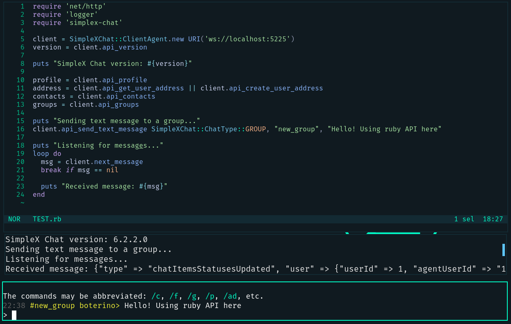

# simplex-chat-ruby
A port for the SimpleX Chat client API for Ruby

## License
This project is licensed under the GNU AGPL-3.0 (no later versions).

Read `LICENSE` for more information.

## Showcase



## Usage

1. Install the Gem from RubyGems
   ```shell
   gem install simplex-chat
   ```


2. Start your local simplex-chat client on port 5225 (or any port you wish)

   ```shell
   simplex-chat -p 5225
   ```

3. Connect the `SimpleXChat::ClientAgent` to your local client

   ```rb
   require 'simplex-chat'
   require 'net/http'

   client = SimpleXChat::ClientAgent.new URI('ws://localhost:5225')
   ```


4. Now the client is connected and you can start using the APIs

   ```rb
   # Get version
   version = client.api_version
   puts "SimpleX Chat version: #{version}"

   # Listen to incoming client messages
   loop do
     chat_msg = client.next_chat_message
     break if chat_msg == nil

     # Reply if user sends '/say_hello'
     if chat_msg[:msg_text] == "/say_hello"
       client.api_send_text_message chat_msg[:chat_type], chat_msg[:sender], "Hello! This was sent automagically"
     end
   end

   # Much more... Read the examples for more information
   ```
